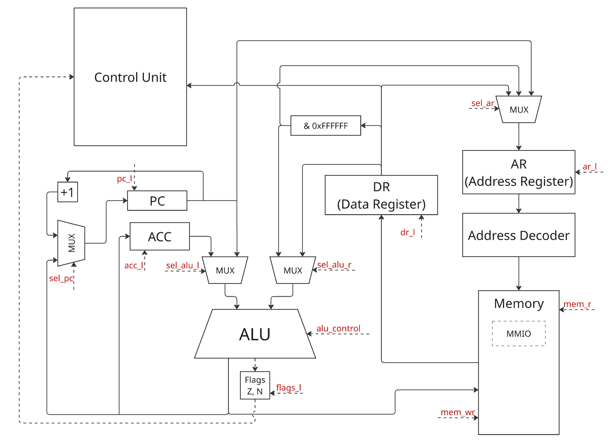
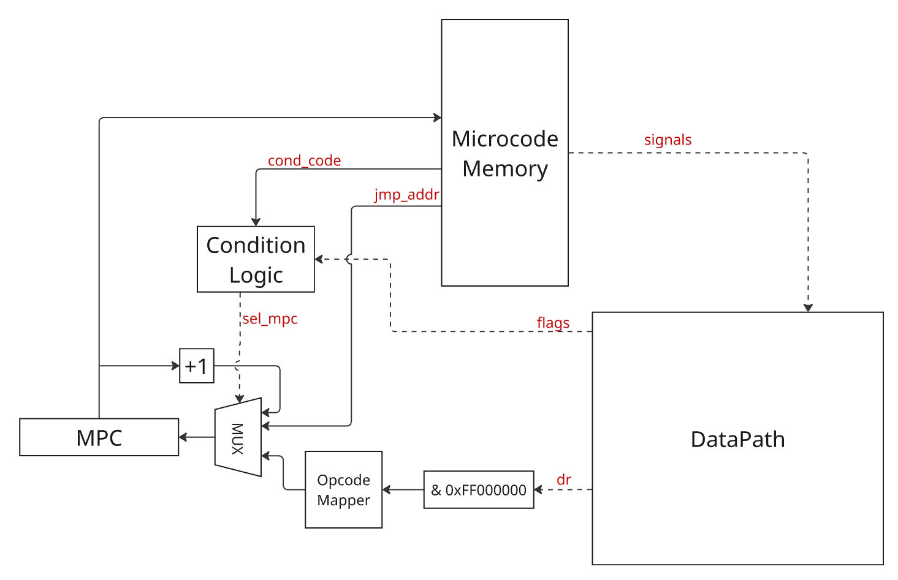

# Лабораторная работа №4

- **ФИО:** Козаченко Данил Александрович
- **Группа:** P3212
- **Вариант:** `alg | acc | neum | mc | tick | binary | stream | mem | pstr | prob1 | -` (без усложнения `cache`)
  - `alg` - синтаксис языка должен напоминать java/javascript/lua. Должен поддерживать математические выражения.
    - В тестах необходимо осуществить проверку AST. Оно должно быть человекочитаемым.
  - `acc` - система команд должна быть выстроена вокруг аккумулятора.
    - Инструкции - изменяют значение, хранимое в аккумуляторе.
    - Ввод-вывод осуществляется через аккумулятор.
  - `neum` - фон Неймановская архитектура.
  - `mc` - microcoded.
    - В отчёте необходимо задокументировать уровень микроинструкций.
    - Моделирование должно выполняться с точностью до такта.
    - Микрокод должен быть сохранён в отдельной памяти для микропрограмм.
    - Модель процессора должна исполнять микрокод.
  - `tick` - процессор необходимо моделировать с точностью до такта, процесс моделирования может быть приостановлен на любом такте.
  - `binary` - бинарное представление.
    - Требуются настоящие бинарные файлы, а не текстовые файлы с `0` и `1`.
    - Требуется отладочный вывод в текстовый файл вида:
        ```
        <address> - <HEXCODE> - <mnemonic>
        20 - 03340301 - add #01 <- 34 + #03
        ```
  - `stream` - Ввод-вывод осуществляется как поток токенов. Логика работы:
    - При старте модели у вас есть буфер, в котором представлены все данные ввода (`['h', 'e', 'l', 'l', 'o']`).
    - При обращении к вводу (выполнение инструкции) модель процессора получает "токен" (символ) информации.
    - Если данные в буфере кончились - останавливайте моделирование.
    - Вывод данных реализуется аналогично, по выполнении команд в буфер вывода добавляется ещё один символ.
    - По окончании моделирования показать все выведенные данные.
    - Логика работы с буфером реализуется в рамках модели на Python.
  - `mem` - memory-mapped (порты ввода-вывода отображаются в память и доступ к ним осуществляется штатными командами),
    - отображение портов ввода-вывода в память должно конфигурироваться (можно hardcode-ом).
  - `pstr` - Length-prefixed (Pascal string)
    - Статические строки должны храниться в памяти (секции) данных.
    - Один символ может храниться в одном машинном слове (несмотря на явную неэффективность).
    - Работа со строками реализуется процедурами или функциями на разработанном вами языке.
  - `prob1` - Euler problem 4 [link](https://projecteuler.net/problem=4)

## Язык программирования
### Синтаксис (BNF)
```
<program>       ::= { <statement> "\n" }
<statement>     ::= <declaration>
                  | <assignment>
                  | <str-spec-decl>
                  | <input>
                  | <output>
                  | <if-start>
                  | <else-start>
                  | <while-start>
                  | "end"
<declaration>   ::= "var" <type> <id>
<type>          ::= "num" | "char" | "pstr"
<assignment>    ::= "set" <id> "=" <expr>
<str-spec-decl> ::= "pstr" <id> <string>   

<input>         ::= "input" "(" <id> ")"
<output>        ::= "print" "(" ( <expr> | <id> ) ")"

<if-start>      ::= "if" <condition> ":"
<else-start>    ::= "else" ":"
<while-start>   ::= "while" <condition> ":"
<condition>     ::= <expr> <cmp-op> <expr>
<cmp-op>        ::= "==" | "!=" | "<" | "<=" | ">" | ">="

<expr>          ::= <sum>
<sum>           ::= <product> { ("+" | "-") <product> }
<product>       ::= <atom> { ("*" | "/" | "//" | "%") <atom> }
<atom>          ::= <integer> | <id> | "-" <atom> | "(" <expr> ")"
<id>            ::= <letter> { <letter> | <digit> | "_" }

<integer>       ::= <digit> { <digit> }
<string>        ::= '"' { <char> } '"'
<letter>        ::= "A" | ... | "Z" | "a" | ... | "z" | "_"
<digit>         ::= "0" | ... | "9"
```

### Семантика
- **Стратегия вычислений** - строгая, последовательная. Операторы выполняются сверху вниз в порядке записи в исходном файле
- **Области видимости** - все переменные являются глобальными и размещаются статически
- **Типизация** - статическая, явная. Типы: `num`, `char`, `pstr`
  - `num` хранится как 32-битное знаковое слово
  - `char` хранится как ASCII-код в одном машинном слове
  - `pstr` хранится в памяти в Pascal-формате: длина, затем символы `char`
- `var` объявляет переменную, `pstr name "text"` объявляет строковую константу
- `set name = expr` вычисляет выражение и записывает результат в переменную
- `if/else/end` выполняет ветвление по условию
- `while/end` повторяет блок, пока условие истинно
- `input(x)` читает следующее значение из входного потока через `IN_PORT`
- `print(x)` выводит значение через `OUT_PORT`

## Организация памяти

Архитектура фон-Неймановская: инструкции и данные находятся в едином линейном адресном пространстве памяти. 
Память адресуется машинными словами, один адрес соответствует одному 32-битному слову.

Программист напрямую работает только с переменными языка; на уровне ISA программно видимым является только регистр ACC

- Машинное слово - 32 бита
- Инструкция занимает одно машинное слово
- Адрес в инструкции хранится в поле operand размером 24 бита
- Прямо адресуемая память ограничена 2^24 словами
- Для адресов operand расширяется нулями до 32 бит
- Для immediate-значений operand расширяется знаком до 32 бит

Структура памяти:

|     Адрес     |            Назначение             |
|:-------------:|:---------------------------------:|
|    0x0000     |              IN_PORT              |
|    0x0001     |             OUT_PORT              |
|    0x0002     |             CODE_BASE             |
| 2 + code_size | начало статической области данных |


После секции кода транслятор размещает данные:
1. глобальные переменные;
2. временные ячейки для вычисления выражений;
3. строковые литералы и буферы `pstr`.

Ввод-вывод реализован через memory-mapped IO. Чтение из адреса `IN_PORT` берёт следующий токен из входного потока. Запись в адрес `OUT_PORT` добавляет символ в выходной поток.

Память микропрограмм отделена от основной памяти и недоступна программному коду. Она используется только Control Unit для исполнения микрокода.

## Система команд
> [!NOTE]
> Все арифметико-логические операции неявно используют регистр `ACC` как первый операнд и место для сохранения результата. Второй операнд берется либо из памяти, либо из самой инструкции

Машинное слово имеет размер 32 бита. Каждая инструкция кодируется одним машинным словом:
```
31........24 23........................0
opcode       operand
8 бит        24 бита
```

### Набор инструкций

| Мнемоника                                  | Опкод  | Такты** | Описание                          | Операция (семантика)                             |
|:-------------------------------------------|:------:|:-------:|:----------------------------------|:-------------------------------------------------|
| **Операции с памятью**                     |        |         |                                   |                                                  |
| `LD`                                       | `0x10` |    3    | Прямая загрузка                   | `ACC <- Mem[arg]`                                |
| `LDI`                                      | `0x11` |    1    | Непосредственная загрузка         | `ACC <- arg`                                     |
| `LD_IND`                                   | `0x12` |    5    | Косвенная загрузка (по указателю) | `ACC <- Mem[Mem[arg]]`                           |
| `ST`                                       | `0x13` |    2    | Прямое сохранение                 | `Mem[arg] <- ACC`                                |
| `ST_IND`                                   | `0x14` |    4    | Косвенное сохранение              | `Mem[Mem[arg]] <- ACC`                           |
| **Арифметика (АЛУ выставляет флаги N, Z)** |        |         |                                   |                                                  |
| `ADD`                                      | `0x20` |    3    | Сложение с памятью                | `ACC <- ACC + Mem[arg]`                          |
| `ADDI`                                     | `0x21` |    1    | Сложение с константой             | `ACC <- ACC + arg`                               |
| `SUB`                                      | `0x22` |    3    | Вычитание из памяти               | `ACC <- ACC - Mem[arg]`                          |
| `SUBI`                                     | `0x23` |    1    | Вычитание константы               | `ACC <- ACC - arg`                               |
| `MUL`                                      | `0x24` |    3    | Умножение на память               | `ACC <- ACC * Mem[arg]`                          |
| `DIV`                                      | `0x25` |    3    | Целочисленное деление на память   | `ACC <- ACC // Mem[arg]`                         |
| `MOD`                                      | `0x26` |    3    | Остаток от деления на память      | `ACC <- ACC % Mem[arg]`                          |
| `CMP`                                      | `0x27` |    3    | Сравнение с памятью               | Только уст. флаги Z, N операции `ACC - Mem[arg]` |
| `CMPI`                                     | `0x28` |    1    | Сравнение с константой            | Только уст. флаги Z, N операции `ACC - arg`      |
| **Инструкции перехода**                    |        |         |                                   |                                                  |
| `JMP`                                      | `0x30` |    1    | Безусловный переход               | `PC <- arg`                                      |
| `BEQ`                                      | `0x31` |  1/2*   | Переход если Ноль (==)            | `if (Z == 1) PC <- arg`                          |
| `BNE`                                      | `0x32` |  1/2*   | Переход если Не ноль (!=)         | `if (Z == 0) PC <- arg`                          |
| `BLT`                                      | `0x33` |  1/2*   | Переход если Меньше (<)           | `if (N == 1) PC <- arg`                          |
| `BGT`                                      | `0x34` |  1/2*   | Переход если Больше (>)           | `if (N == 0 && Z == 0) PC <- arg`                |
| `HLT`                                      | `0xFF` |    1    | Остановка симуляции               | приплыли                                         |

*\* Для инструкций ветвления: 1 такт, если переход не выполняется, и 2 такта, если переход происходит (требуется доп. такт на запись адреса в регистр `PC`).*
*\*\* Перед выполнением каждой инструкции происходит чтение команды за 2 такта.*

> Instruction Fetch:
> 1: DR <- Memory[AR], PC <- PC + 1
> 2: MPC <- DR, AR <- PC

### Микрокоманды
todo

## Транслятор
todo

## Модель процессора
### DataPath

`DataPath` содержит:
- `ACC` - аккумулятор, основной программно-видимый регистр;
- `ALU` - выполняет арифметические операции и сравнение;
- `PC` - счётчик команд;
- `DR` - регистр данных памяти. Используется как буфер при чтении инструкций и данных;
- `AR` - адресный регистр для обращения к памяти;
- `Memory` - единая память команд и данных с MMIO-адресами.

### ControlUnit

`ControlUnit` содержит:
- `MPC` - счётчик микрокоманд;
- `Opcode Mapper` - выбирает начальный адрес микропрограммы по opcode;
- `Microcode Memory` - память микрокоманд;
- `Condition Logic` - проверяет флаги для условных переходов.

## Тестирование
todo
